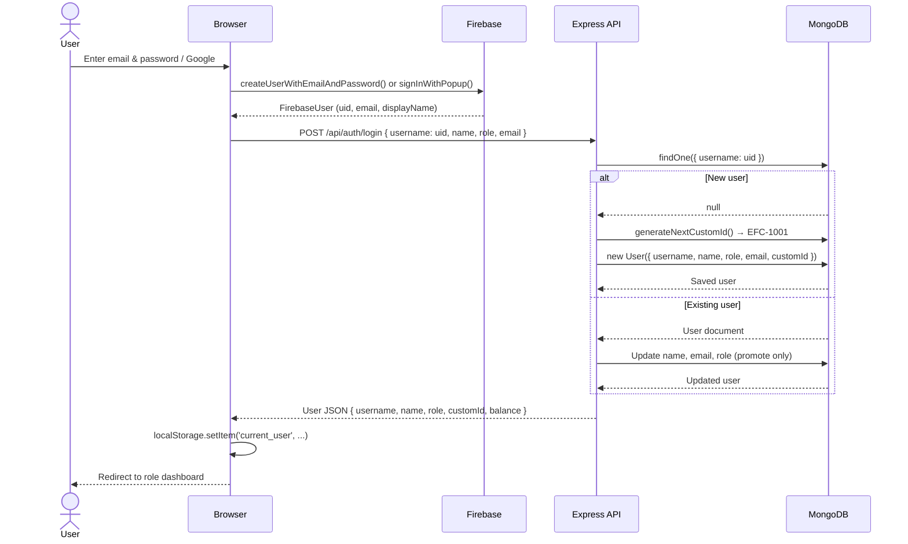
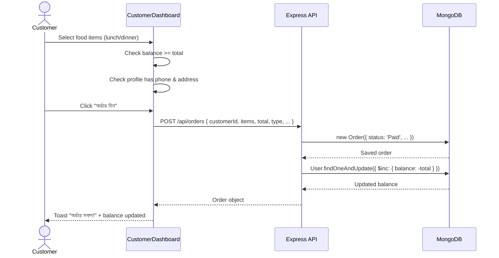
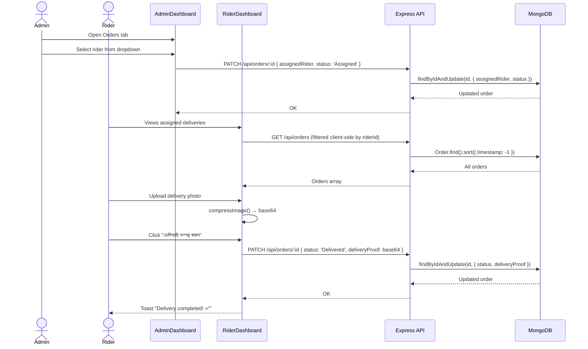
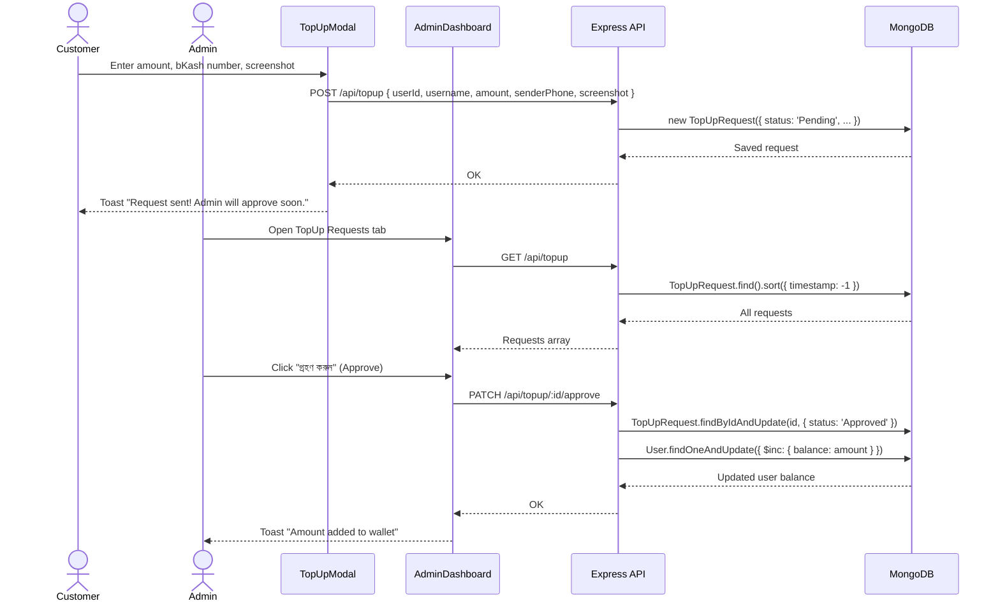
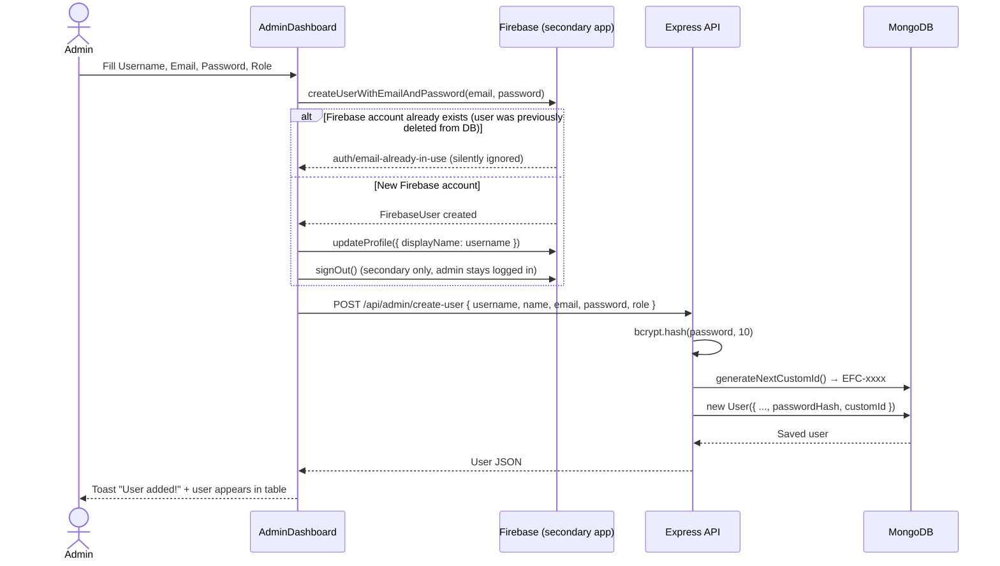
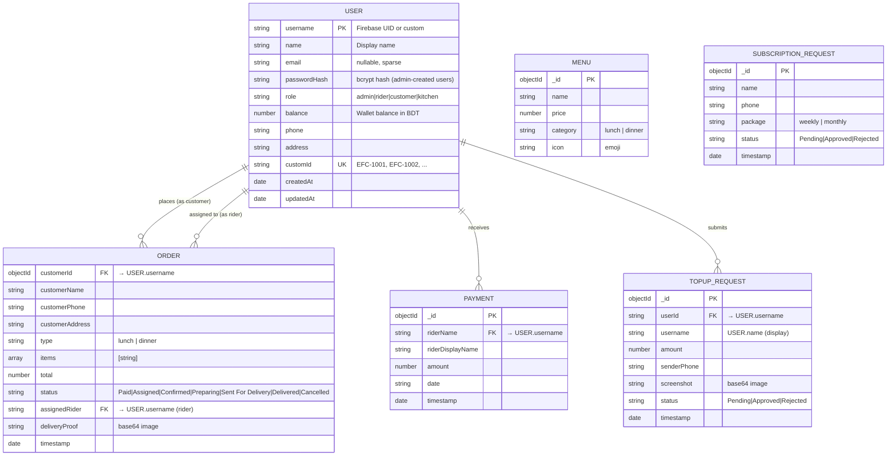

# Food Catering Barisal — Design Documentation

---

## 1. Sequence Diagrams

### 1.1 User Authentication (Firebase + MongoDB)



---

### 1.2 Customer Places an Order



---

### 1.3 Admin Assigns Rider → Rider Delivers



---

### 1.4 Customer Top-Up → Admin Approval



---

### 1.5 Admin Creates User Manually (with bcrypt)



---

## 2. ER Diagram



---

## 3. UI Mockups

### 3.1 Landing Page

```
╔══════════════════════════════════════════════════════════════════════╗
║  🍱 ফুড ক্যাটারিং বরিশাল    [প্রক্রিয়া] [মেনু] [প্যাকেজ]  [লগইন] ║
╠══════════════════════════════════════════════════════════════════════╣
║                                                                      ║
║   🔴 এখন অর্ডার নিচ্ছি · বরিশাল সিটি                               ║
║                                                                      ║
║    রান্নার ঝামেলা|  থেকে          ← typewriter cursor               ║
║    মুক্তি পান আজই!                                                   ║
║                                                                      ║
║    অফিসগামী বা শিক্ষার্থীদের জন্য সেরা মান্থলি মিল ক্যাটারিং...   ║
║                                                                      ║
║    [মেম্বারশিপ শুরু করুন ✦]    [প্ল্যানগুলো দেখুন]                 ║
║                                                                      ║
║                        ↓ স্ক্রোল করুন                               ║
╠══════════════════════════════════════════════════════════════════════╣
║  STATS BAR                                                           ║
║  ┌──────────┐  ┌──────────┐  ┌──────────┐  ┌──────────┐           ║
║  │   500+   │  │   30K+   │  │  3 বছর  │  │   99%    │           ║
║  │  সদস্য   │  │  ডেলিভারি │  │ অভিজ্ঞতা │  │ সন্তুষ্টি │           ║
║  └──────────┘  └──────────┘  └──────────┘  └──────────┘           ║
╠══════════════════════════════════════════════════════════════════════╣
║  HOW IT WORKS                                                        ║
║  ┌──────────────┐    ┌──────────────┐    ┌──────────────┐          ║
║  │   ধাপ ০১     │────│   ধাপ ০২     │────│   ধাপ ০৩     │          ║
║  │     📦       │    │     ✅       │    │     🚴       │          ║
║  │ প্যাকেজ বাছাই │    │ অর্ডার নিশ্চিত│    │   ডেলিভারি  │          ║
║  └──────────────┘    └──────────────┘    └──────────────┘          ║
╠══════════════════════════════════════════════════════════════════════╣
║  MENU PREVIEW                                                        ║
║  ┌────────────────┐  ┌────────────────┐  ┌────────────────┐        ║
║  │  [FOOD IMAGE]  │  │  [FOOD IMAGE]  │  │  [FOOD IMAGE]  │        ║
║  │  বেস্ট সেলার   │  │  ঘরোয়া স্বাদ   │  │   প্রিমিয়াম   │        ║
║  │ চিকেন বিরিয়ানি │  │  রুই মাছের ঝোল │  │ বিফ কারি লাঞ্চ │        ║
║  │   ৳ ২২০       │  │   ৳ ১৮০       │  │   ৳ ২৪০       │        ║
║  │ [বুক করুন]    │  │ [বুক করুন]    │  │ [বুক করুন]    │        ║
║  └────────────────┘  └────────────────┘  └────────────────┘        ║
╠══════════════════════════════════════════════════════════════════════╣
║  TESTIMONIALS (auto-scrolling marquee)                               ║
║  ◀ "রান্নার ঝামেলা থেকে..." ★★★★★   "হোস্টেলে থেকে..." ★★★★★ ▶   ║
╠══════════════════════════════════════════════════════════════════════╣
║  PACKAGES                                                            ║
║  ┌─────────────────────┐    ╔═════════════════════╗                 ║
║  │  সাপ্তাহিক ট্রায়াল  │    ║ ⭐ সেরা অফার         ║                 ║
║  │       📅            │    ║   প্রফেশনাল মান্থলি  ║                 ║
║  │    ৳ ১৪০০ / সপ্তাহ  │    ║   🏆                 ║                 ║
║  │  ✦ ৭ দিন ডাবল মিল  │    ║  ৳ ৫০০০ / মাস        ║                 ║
║  │  ✦ ফ্রি ডেলিভারি   │    ║  ✦ ৩০ দিন সার্ভিস   ║                 ║
║  │  [ট্রায়াল শুরু করুন] │    ║  [সাবস্ক্রিপশন নিন]  ║                 ║
║  └─────────────────────┘    ╚═════════════════════╝                 ║
╚══════════════════════════════════════════════════════════════════════╝
```

---

### 3.2 Customer Dashboard

```
╔══════════════════════════════════════════════════════════════════════╗
║  🍱 ফুড ক্যাটারিং বরিশাল  Welcome, Karim (EFC-1042)               ║
║  [Menu] [Transactions] [Profile]   ৳ 1,250.00  [+ Top Up] [Logout] ║
╠═══════════════════════════════════════════╦══════════════════════════╣
║                                           ║  আমার অর্ডারসমূহ        ║
║  🍱 দুপুরের লাঞ্চ                         ║  ─────────────────────── ║
║  ডেডলাইন: সকাল ১০:০০  সময় বাকি: 2:15:30 ║  লাঞ্চ         ৳ 220   ║
║  ┌──────┐ ┌──────┐ ┌──────┐ ┌──────┐    ║  ডেলিভারড      🧾       ║
║  │  🍛  │ │  🥘  │ │  🍲  │ │  🥗  │    ║  ভাত, বিরিয়ানি          ║
║  │চিকেন │ │ মাছ  │ │ডাল  │ │সালাদ│    ║  ─────────────────────── ║
║  │৳ 220 │ │৳ 180 │ │৳ 80 │ │৳ 60 │    ║  ডিনার         ৳ 180   ║
║  │ ✓SEL │ │      │ │      │ │      │    ║  রাইডার নির্ধারিত  🧾    ║
║  └──────┘ └──────┘ └──────┘ └──────┘    ║  মাছের ঝোল               ║
║  [লাঞ্চ অর্ডার দিন (৳ 220)]              ║  ─────────────────────── ║
║                                           ║              [সব দেখুন] ║
║  🌙 রাতের ডিনার                          ║                          ║
║  ডেডলাইন: বিকাল ০৫:০০  অর্ডার বন্ধ 🔴   ║                          ║
╚═══════════════════════════════════════════╩══════════════════════════╝

  TRANSACTION HISTORY TAB:
╔══════════════════════════════════════════════════════════════════════╗
║  ┌──────────┐  ┌──────────┐  ┌──────────┐                          ║
║  │  ৳ 2400  │  │  ৳ 400   │  │ ৳ 1,250  │                          ║
║  │মোট রিচার্জ│  │মোট খরচ  │  │ব্যালেন্স │                          ║
║  └──────────┘  └──────────┘  └──────────┘                          ║
║                                                                      ║
║  ORDER HISTORY                                                       ║
║  Date       Type    Items            Total  Status      Receipt     ║
║  14/05/26   লাঞ্চ   চিকেন, ডাল       ৳220  ডেলিভারড   [🧾 Receipt]║
║  13/05/26   ডিনার   মাছ              ৳180  Assigned    [🧾 Receipt]║
║                                                                      ║
║  TOP-UP HISTORY                                                      ║
║  Date       Amount    Status                                         ║
║  10/05/26   + ৳ 1000  অনুমোদিত 🟢                                   ║
║  08/05/26   + ৳ 1400  অনুমোদিত 🟢                                   ║
╚══════════════════════════════════════════════════════════════════════╝
```

---

### 3.3 Admin Dashboard

```
╔══════════════════════════════════════════════════════════════════════╗
║  🍱 ফুড ক্যাটারিং বরিশাল  Welcome, Admin  [Logout]                 ║
╠══════════════════════════════════════════════════════════════════════╣
║  [Overview] [👥 Users] [Menu] [Riders] [Orders] [TopUp] [Membership]║
╠══════════════════════════════════════════════════════════════════════╣
║  OVERVIEW TAB                                                        ║
║  ┌──────────────┐  ┌──────────────┐  ┌──────────────┐              ║
║  │  ৳ 12,450    │  │     58       │  │     24       │              ║
║  │   মোট আয়    │  │  মোট অর্ডার  │  │  কাস্টমার    │              ║
║  └──────────────┘  └──────────────┘  └──────────────┘              ║
╠══════════════════════════════════════════════════════════════════════╣
║  USERS TAB                                                           ║
║  ┌─────────────────────────────────────────────────────────────┐   ║
║  │ ➕ Add User Manually                                         │   ║
║  │  [Username_______] [Email__________] [Password 👁] [Role ▼]│   ║
║  │  [        Add User        ]                                  │   ║
║  └─────────────────────────────────────────────────────────────┘   ║
║  🔴 admin·3   🟡 kitchen·1   🔵 rider·4   🟢 customer·16           ║
║  [Search...] [All Roles ▼] [↻ Refresh]                             ║
║  ┌───────────┬──────────────┬───────┬────────┬───────┬────────┐   ║
║  │ User ID   │ Name         │ Phone │Balance │ Role  │ Action │   ║
║  ├───────────┼──────────────┼───────┼────────┼───────┼────────┤   ║
║  │ EFC-1001  │ Karim H.     │ 017.. │৳ 1250 │customer│[Del]  │   ║
║  │ EFC-1002  │ Sadia I.     │ 018.. │৳ 800  │ rider  │[Del]  │   ║
║  └───────────┴──────────────┴───────┴────────┴───────┴────────┘   ║
╠══════════════════════════════════════════════════════════════════════╣
║  RIDERS TAB                                                          ║
║  ┌──────────────────┐    ┌──────────────────┐                       ║
║  │ 🛵 Rider List    │    │ 💸 Pay Rider     │                       ║
║  │ Sadia · Pend ৳90 │    │ [Select Rider ▼] │                       ║
║  │ Earned ৳120·Paid │    │ [Amount________] │                       ║
║  │ ৳30              │    │ [পেমেন্ট নিশ্চিত]│                       ║
║  └──────────────────┘    └──────────────────┘                       ║
╚══════════════════════════════════════════════════════════════════════╝

  PAY RECEIPT MODAL (appears after payment):
  ╔══════════════════════╗
  ║   🧾 Payment Receipt  ║
  ║   ফুড ক্যাটারিং বরিশাল║
  ║  ──────────────────── ║
  ║  Rider    Sadia Islam  ║
  ║  Amount   ৳ 90        ║
  ║  Date     14/05/2026  ║
  ║  Ref #    A3F9C12E   ║
  ║  [🖨️ Print] [Close]  ║
  ╚══════════════════════╝
```

---

### 3.4 Rider Dashboard

```
╔══════════════════════════════════════════════════════════════════════╗
║  🍱 ফুড ক্যাটারিং বরিশাল  Welcome, Sadia (Rider)  [Logout]        ║
╠══════════════════════════════════════════════════════════════════════╣
║  ┌──────────────┐  ┌──────────────┐  ┌──────────────┐              ║
║  │    ৳ 120     │  │     ৳ 30     │  │     ৳ 90     │              ║
║  │  💰 মোট আয়  │  │ 💸 পেইড      │  │ ⏳ বকেয়া     │              ║
║  │  4টি ডেলিভারি│  │              │  │              │              ║
║  └──────────────┘  └──────────────┘  └──────────────┘              ║
╠══════════════════════════════════════════════════════════════════════╣
║  🚚 আমার নির্ধারিত ডেলিভারি                                         ║
║  ┌──────────────────────────────────────────────────────────────┐  ║
║  │  [পেইড]          বিল: ৳ 220                                  │  ║
║  │  👤 Karim Hossain   📞 01700-000000                          │  ║
║  │  📍 সদর রোড, বরিশাল                                         │  ║
║  │                    📸 Delivery Proof                          │  ║
║  │                    ┌──────────────┐                           │  ║
║  │                    │  [delivered  │                           │  ║
║  │                    │   photo.jpg] │  ← already delivered      │  ║
║  │                    └──────────────┘                           │  ║
║  └──────────────────────────────────────────────────────────────┘  ║
║  ┌──────────────────────────────────────────────────────────────┐  ║
║  │  [পেইড]          বিল: ৳ 180                                  │  ║
║  │  📸  ┌── dashed ──┐  [📷 Tap to Upload]                      │  ║
║  │      │            │                                           │  ║
║  │      └────────────┘  [ডেলিভারি সম্পন্ন করুন ✅]              │  ║
║  └──────────────────────────────────────────────────────────────┘  ║
╠══════════════════════════════════════════════════════════════════════╣
║  💳 পেমেন্ট ইতিহাস                                                  ║
║  Date        Amount    Ref #       Receipt                          ║
║  14/05/26    ৳ 30      A3F9C12E   [🧾 Receipt]                     ║
╚══════════════════════════════════════════════════════════════════════╝
```

---

## 4. API Design

### Base URL
- **Development:** `http://localhost:5001/api`
- **Production:** `https://<vercel-domain>/api`

---

### 4.1 Auth & User Endpoints

| Method | Endpoint | Description | Auth |
|--------|----------|-------------|------|
| `POST` | `/auth/login` | Create or sync a user after Firebase login | — |
| `POST` | `/admin/create-user` | Admin creates a user with hashed password | Admin |
| `GET` | `/users` | List all users | Admin |
| `GET` | `/users/:username` | Get a single user | Any |
| `PATCH` | `/users/:username/profile` | Update phone & address | User |
| `PATCH` | `/users/:username/role` | Change user role | Admin |
| `DELETE` | `/users/:username` | Delete a user | Admin |

#### `POST /auth/login`
```json
// Request
{
  "username": "firebase_uid_or_custom",
  "name": "Karim Hossain",
  "role": "customer",
  "email": "karim@example.com"
}

// Response 200
{
  "_id": "...",
  "username": "firebase_uid",
  "name": "Karim Hossain",
  "email": "karim@example.com",
  "role": "customer",
  "balance": 0,
  "customId": "EFC-1042",
  "createdAt": "2026-05-14T..."
}
```

#### `POST /admin/create-user`
```json
// Request
{
  "username": "karim_hossain",
  "name": "Karim Hossain",
  "email": "karim@example.com",
  "password": "secret123",
  "role": "customer"
}

// Response 200 — user saved with bcrypt passwordHash, email: null if not provided
// Response 409 — { "error": "Username already exists" }
```

#### `PATCH /users/:username/role`
```json
// Request
{ "role": "rider" }

// Response 200 — updated user object
// Response 404 — { "error": "User not found" }
```

---

### 4.2 Menu Endpoints

| Method | Endpoint | Description |
|--------|----------|-------------|
| `GET` | `/menu` | Get all menu items grouped by category |
| `POST` | `/menu` | Add a new menu item |
| `DELETE` | `/menu/:id` | Remove a menu item |

#### `GET /menu` Response
```json
{
  "lunch": [
    { "_id": "...", "name": "চিকেন বিরিয়ানি", "price": 220, "category": "lunch", "icon": "🍛" }
  ],
  "dinner": [
    { "_id": "...", "name": "রুই মাছের ঝোল", "price": 180, "category": "dinner", "icon": "🐟" }
  ]
}
```

#### `POST /menu`
```json
// Request
{ "name": "বিফ কারি", "price": 240, "category": "lunch", "icon": "🥩" }
```

---

### 4.3 Order Endpoints

| Method | Endpoint | Description |
|--------|----------|-------------|
| `GET` | `/orders` | Get all orders (sorted newest first) |
| `POST` | `/orders` | Place an order (deducts balance) |
| `PATCH` | `/orders/:id` | Update order status / assign rider / upload proof |

#### `POST /orders`
```json
// Request
{
  "customerId": "firebase_uid",
  "customerName": "Karim Hossain",
  "customerPhone": "01700000000",
  "customerAddress": "সদর রোড, বরিশাল",
  "type": "lunch",
  "items": ["চিকেন বিরিয়ানি", "সালাদ"],
  "total": 280
}
// Side-effect: User.balance -= 280
```

#### `PATCH /orders/:id` — Assign Rider
```json
{ "assignedRider": "sadia_islam", "status": "Assigned" }
```

#### `PATCH /orders/:id` — Mark Delivered
```json
{ "status": "Delivered", "deliveryProof": "data:image/jpeg;base64,..." }
```

---

### 4.4 Top-Up Endpoints

| Method | Endpoint | Description |
|--------|----------|-------------|
| `GET` | `/topup` | All requests (admin). `?userId=x` filters by user |
| `POST` | `/topup` | Submit a top-up request |
| `PATCH` | `/topup/:id/approve` | Approve & credit wallet |
| `PATCH` | `/topup/:id/reject` | Reject request |

#### `POST /topup`
```json
{
  "userId": "firebase_uid",
  "username": "Karim Hossain",
  "amount": 500,
  "senderPhone": "01800000000",
  "screenshot": "data:image/jpeg;base64,..."
}
```

#### `PATCH /topup/:id/approve`
```
// No body required
// Side-effect: User.balance += request.amount
// Response: updated TopUpRequest
```

---

### 4.5 Rider & Payment Endpoints

| Method | Endpoint | Description |
|--------|----------|-------------|
| `GET` | `/riders` | All users with role = 'rider' |
| `POST` | `/riders` | Add/promote user to rider (upsert) |
| `GET` | `/payments` | All payments. `?rider=x` filters by riderName |
| `POST` | `/payments` | Record a payment to a rider |

#### `POST /payments`
```json
{
  "riderName": "sadia_islam",
  "riderDisplayName": "Sadia Islam",
  "amount": 90,
  "date": "14/05/2026"
}
// Response: { "_id": "...", ...payment, "timestamp": "2026-05-14T..." }
```

---

### 4.6 Subscription Endpoints

| Method | Endpoint | Description |
|--------|----------|-------------|
| `GET` | `/subscriptions` | All subscription requests |
| `POST` | `/subscriptions` | Submit from landing page |
| `PATCH` | `/subscriptions/:id` | Update status |
| `DELETE` | `/subscriptions/:id` | Delete a request |

#### `POST /subscriptions`
```json
{ "name": "Karim Hossain", "phone": "01700000000", "package": "monthly" }
```

---

### 4.7 Health Check

| Method | Endpoint | Response |
|--------|----------|----------|
| `GET` | `/health` | `{ "status": "ok", "db": "connected" }` |

---

### Error Response Format
```json
{ "error": "Human-readable error message" }
```

| Code | Meaning |
|------|---------|
| 200 | Success |
| 400 | Bad request / missing fields |
| 404 | Resource not found |
| 409 | Conflict (e.g. username already exists) |
| 500 | Server / database error |
